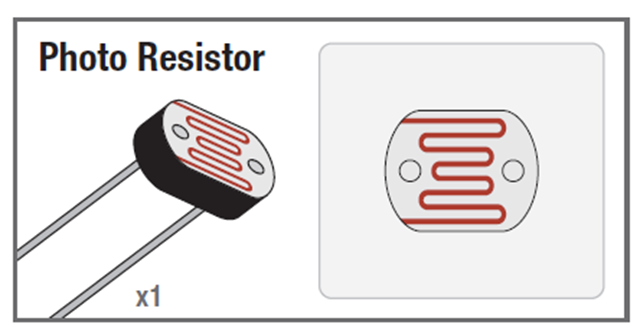
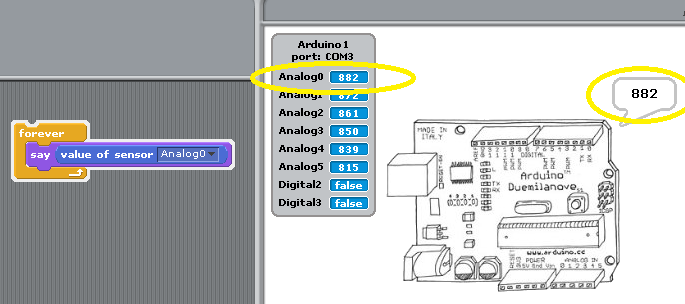
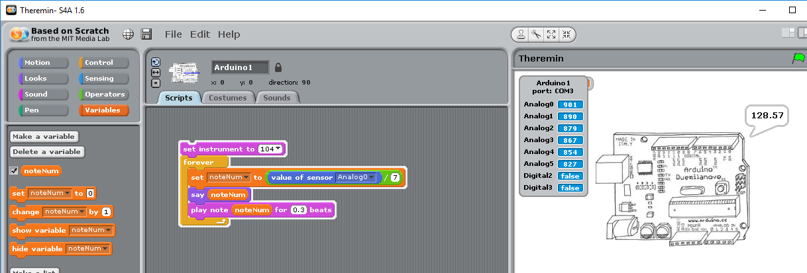

# Build a Theremin like musical instrument
In this lab we will build a musical instrument that is controlled with a photoresitor. The photoresistor will respond to the shadow of our hand, so we won't need to actually touch it to make it respond. This will create an instrument similar to a [Theremin](https://en.wikipedia.org/wiki/Theremin), an electronic musical instrument that is played without touching it.
### Step 1: Build the circuit
Our Theremin will use the following parts:
- 10KΩ resistor
- Photoresistor
- Jumper wires   

Use the picture below to make sure you are using correct 10KΩ resistor.   
   
The photoresistor has two leads of equal length. It is shown below:   
    
Use the following circuit diagram to construct the circuit. The direction of the photoresistor and the 10KΩ resistor is unimportant.   

### Step 2: Test the circuit
Test your circuit by using your hand to create a shadow over the photoresistor. A shadow should decrease the the value of the **Analog0** sensor. You can display the value in a say block or just look at **Analog0** in the sensors display.   

### Step 3: Write the program
We will use the input from the photoresistor to play a note number on one of scratch's built in musical instruments from the Sound tab. The numbers generated by the the sensor are larger than ideal for musical notes, so use a `/` (division operator) block to decrease the sensor values. You may find it convienant to use a variable to store the note number. Here is one possible program:   
   
Feel free to modify your theremin circuit or code in any way you wish. Have fun and be creative, your theremin doesn't have to work or sound like any other.

### Step 4: Submit your finished program
Have your teacher or a TA verify that you have a working program. Submit your finished program by uploading the .sb file to Google classroom. You should be able to find it in *My Documents | Scratch Projects*. If you worked with a partner, each partner should submit a copy of the finished program to Google classroom.

### Step 5: Save your circuit!
We are going to use the same resistor and photoresistor conifiguration in the next lab
